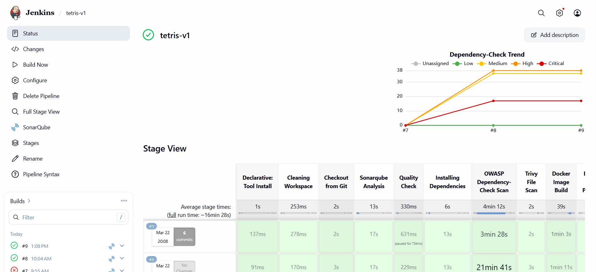
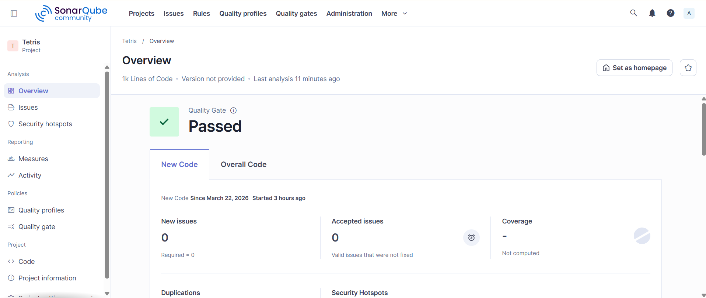
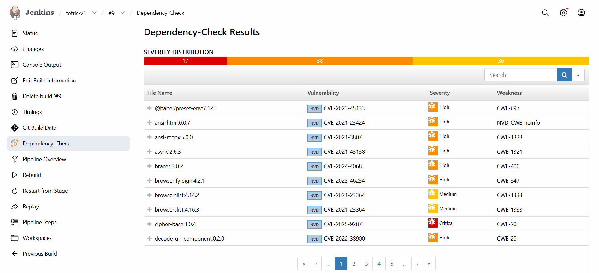
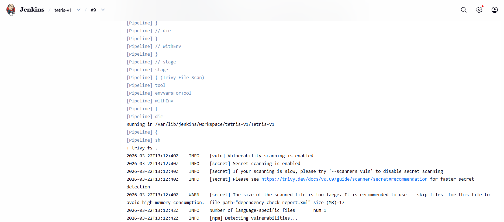
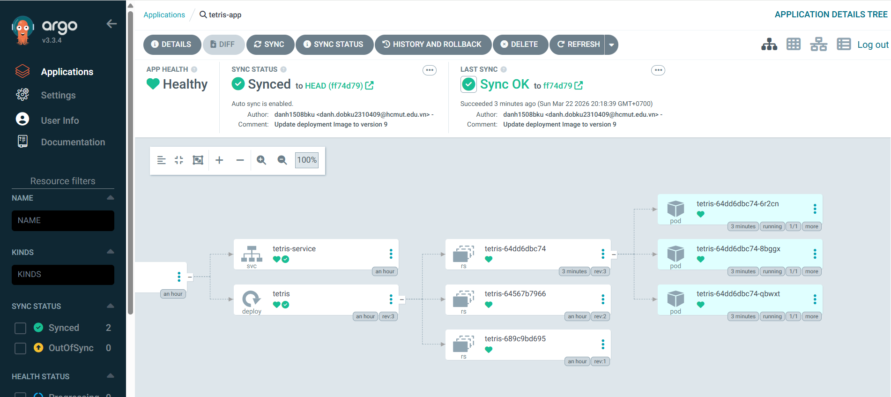
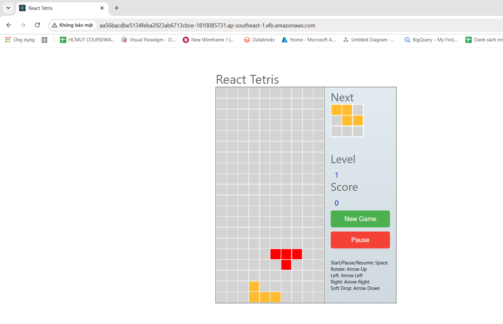
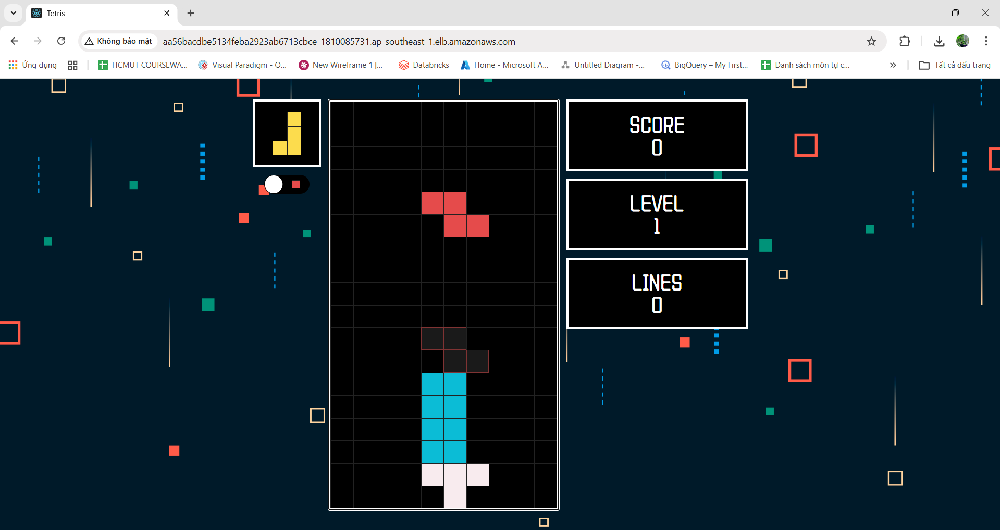

# 🚀 End-to-End DevSecOps Kubernetes Project 🌐

## 📌 Project Overview
This project demonstrates a complete, automated **DevSecOps** and **GitOps** pipeline for deploying a containerized Tetris application on **AWS EKS**. It showcases the integration of Infrastructure as Code (IaC), continuous integration, security scanning, and continuous delivery.

## Directories 📂

1. **EKS-TF:** Terraform scripts for deploying EKS clusters on AWS.
2. **Jenkins-Pipeline-Code:** Jenkins pipeline code for automated CI/CD.
3. **Jenkins-Server-TF:** Terraform scripts for provisioning Jenkins servers on AWS EC2.
4. **Manifest-file:** Kubernetes manifest files for Tetris application deployment.
5. **Tetris-V1:** Initial version of the Tetris game application.
6. **Tetris-V2:** Enhanced version of the Tetris game application.

## 🏗️ Architecture & CI/CD Pipeline Workflow
The deployment lifecycle is fully automated with the following stages:
1. **Infrastructure Provisioning:** AWS EKS cluster and Jenkins EC2 instances are provisioned automatically using **Terraform**.
2. **Continuous Integration (CI):** **Jenkins** fetches the source code and triggers the build pipeline.
3. **Code Quality & Security (DevSecOps):** - **SonarQube** performs Static Application Security Testing (SAST) and code quality checks.
   - **OWASP Dependency-Check** scans for vulnerabilities in third-party libraries.
   - **Trivy** scans the Docker file and the final Docker image for critical vulnerabilities.
4. **Containerization:** The application is built into a **Docker** image and pushed to Docker Hub.
5. **Continuous Deployment (CD) & GitOps:** **ArgoCD** monitors the Kubernetes manifest files in the repository and automatically syncs the desired state to the **AWS EKS** cluster.

## 🛠️ Tech Stack & Tools
- **Cloud Provider:** AWS (EC2, EKS)
- **Infrastructure as Code (IaC):** Terraform
- **CI/CD & GitOps:** Jenkins, ArgoCD
- **Containerization & Orchestration:** Docker, Kubernetes
- **Security & Quality:** SonarQube, Trivy, OWASP Dependency-Check

## 🌟 Key Features
- **Zero-Touch Provisioning:** Infrastructure setup is completely code-driven using Terraform modules.
- **Shift-Left Security:** Integrated vulnerability scanning at multiple stages (Code, Dependencies, Container).
- **GitOps Methodology:** Utilized ArgoCD for declarative continuous delivery, ensuring the cluster state always matches the Git repository.
- **Version Control Strategy:** Maintained and deployed multiple application versions (`Tetris-V1` and `Tetris-V2`) smoothly.

## 📸 Project Execution & Visual Workflow

Here is the visual representation of the DevSecOps pipeline execution:

### 1. Continuous Integration with Jenkins

### 2. Static Application Security Testing (SAST)

### 3. Software Composition Analysis (SCA)

### 4. Container Vulnerability Scanning

### 5. Continuous Deployment with ArgoCD (GitOps)

### 6. Final Application Running on AWS EKS

### 7. Successful Application Update (V1 to V2 Validation)

## License 📄
   This project is licensed under the Apache-2.0 license see the [LICENSE](http://www.apache.org/licenses/) file for details.
